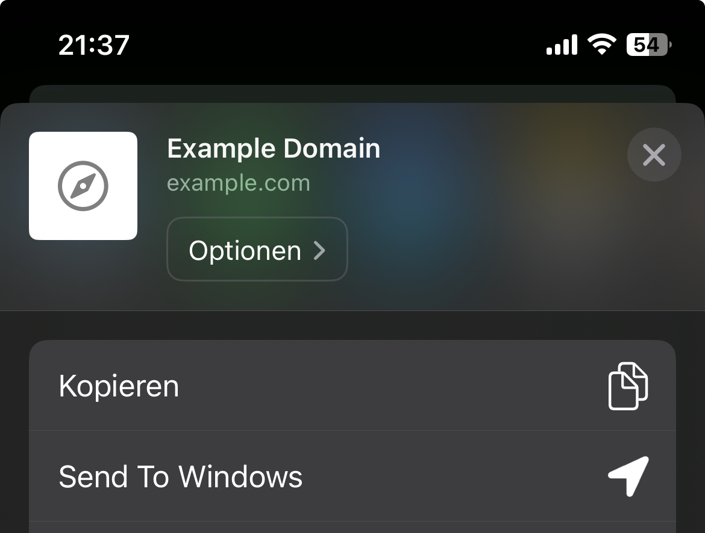

# Send To Windows

Add the "Send to Windows" option to your iPhone share sheet. This feature allows you to send the currently open URL to your Windows computer, where it will automatically open in the default browser.

# Setup

-   [Download](https://nodejs.org/en/download/prebuilt-installer) and install Node.js
-   Download all the files in the server directory in this repository
-   Copy the files to a location where dont annoy you
-   run the install.bat file
-   create a shortcut for the start.vbs script
-   Press `ctrl` + `r`
-   Type `shell:startup` and press enter
-   Copy and paste the shortcut into the directory that has opened
-   The script will automatically start every time you reboot
-   Restart your PC or open start the script manually by douple clicking the shortcut

### Switch to your iPhone

-   Install this [shortcut](https://www.icloud.com/shortcuts/5a61e8e92b834434a73046c62d7f8ad2)
-   You will have to enter your Computers IP address or Name
-   I recommend to use the name, as the ip address can change regularly depending on your network settings

### Find your IP address

-   Press the `win` key on your keyboard
-   type `cmd` and press enter
-   type `ipconfig`in the new window
-   the number after IPv4-Address is your IP address. It should look similar to this: `XXX.XXX.X.XXX`

### Find your Computer name

-   Open the Explorer (`win` + `e`)
-   Right click on `This Computer`
-   Click `Properties`
-   There you will find your devicename, it should look similar like this by default: `DESKTOP-XXXXXXX`

# Use the Shortcut

-   Once everything is setup, you can open a website on safari and click the share button
-   There will be an option `Send To Windows`
-   Click the button and the website will open on your PC

